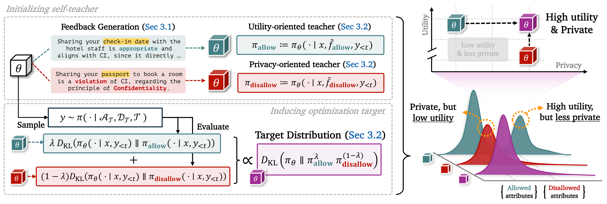

# <p align="center">It Takes Two: Complementary Self-Distillation for Contextual Integrity in LLMs</p>

<p align="center">
  <a href="https://arxiv.org/abs/2605.20258">
    
  </a>
  <a href="https://huggingface.co/papers/2605.20258">
    
  </a>
</p>

we propose **SelfCI**, a complementary self-distillation framework that
decouples information suppression from task resolution for Contextual Integrity in LLMs. This directory contains the training and evaluation scripts for SelfCI and the GRPO-based [CI-RL](https://arxiv.org/abs/2506.04245) baseline on [contextual-integrity dataset](https://huggingface.co/datasets/huseyinatahaninan/ContextualIntegritySyntheticDataset).

<p align="center">
  
</p>

## Setup
- Python `>=3.12`
- A CUDA-capable Linux environment suitable for `flash-attn` and `vllm`
- [`uv`](https://docs.astral.sh/uv/) for dependency management

Install dependencies:

```bash
uv sync
```

Create a local environment file:

```bash
cp .env.example .env
```

Update `.env` with the credentials you need:

- `HF_TOKEN` for gated Hugging Face models or datasets
- `WANDB_API_KEY` and optionally `WANDB_PROJECT` for Weights & Biases logging

All launchers load `.env` automatically.

## SelfCI: Complementary self-distillation framework
This section covers the full SelfCI workflow: generating feedback for a pre-existing dataset, training the self-distilled model, and running the CI-RL (GRPO) baseline.

### Feedback Generation
`generate_feedback_all.py` is a crucial preprocessing step for SelfCI. It generates `allowed_feedbacks` and `disallowed_feedbacks` for a pre-existing contextual-integrity dataset, then saves the enriched dataset locally or pushes it to the Hugging Face Hub.

Because SelfCI is a self-distillation setup, the model used here should match the model used later in SelfCI training.

Basic usage:

```bash
uv run python generate_feedback_all.py \
  --model_path Qwen/Qwen2.5-7B-Instruct
```

The output dataset is augmented with `allowed_feedbacks` and `disallowed_feedbacks`, which are required by the SelfCI training pipeline.


### Train
`run_selfci.sh` launches the SelfCI training pipeline with dual feedback (allowed and disallowed feedback branches) and a weighted KL objective.

Basic usage:

```bash
./run_selfci.sh
./run_selfci.sh Qwen/Qwen2.5-7B-Instruct Qwen/Qwen2.5-7B-Instruct --epochs 2
```

Common overrides:

```bash
GPU_ID=0 \
DATASET_PATH=/path/to/feedback_augmented_dataset_or_hf_repo \
./run_selfci.sh \
  --backward-weight 0.5 \
  --forward-weight 0.5 \
  --teacher-update ema \
  --epochs 2
```

Notes:
- `DATASET_PATH` to override the feedbask-augmented dataset repo or local path
- `BACKWARD_WEIGHT` and `FORWARD_WEIGHT` to control the weights of KL divergence from each teacher.
- By default, training outputs are written under `./output/`.

For the complete interface:

```bash
./run_selfci.sh --help
```

### CI-RL (GRPO)
`run_grpo.sh` launches CI-RL (GRPO), one of the baselines used for comparison.

Basic usage:

```bash
./run_grpo.sh
./run_grpo.sh meta-llama/Llama-3.1-8B-Instruct --epochs 2
```

Common overrides:

```bash
GPU_ID=0 \
./run_grpo.sh \
  Qwen/Qwen2.5-7B-Instruct \
  --batch-size 8 \
  --num-generations 8 \
  --mini-batch-size 64 \
  --epochs 2
```

For the complete interface:

```bash
./run_grpo.sh --help
```

## test
`run_test.sh` evaluates a model or checkpoint on the contextual-integrity test split.

Basic usage:

```bash
./run_test.sh /path/to/model_or_checkpoint
./run_test.sh Qwen/Qwen2.5-7B-Instruct --num-runs 3 --output-dir ./output/eval_qwen
```

Notes:

- `GPU_ID` selects the CUDA device used for evaluation.
- If the target path contains a LoRA adapter, the evaluator can merge it into a temporary model directory before running test.

For all evaluation options:

```bash
./run_test.sh /path/to/model_or_checkpoint --help
```

## Citation
If you find our work useful, please consider citing:
```
@article{
  title={It Takes Two: Complementary Self-Distillation for Contextual Integrity in LLMs},
  author={Park, Sangwoo and Yeo, Woongyeong and Lee, Seanie and Choi, Yumin and Lee, Hyomin and Kim, Kangsan and Baek, Jinheon and Oh, Seong Joon and Hwang, Sung Ju},
  journal={arXiv preprint arXiv:2605.20258},
  year={2026}
}
```
